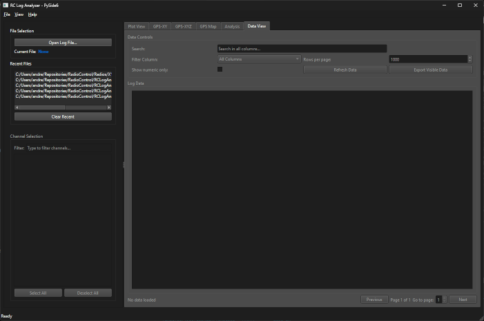

# RC Log Viewer

An application for viewing and analyzing FrSky Ethos, OpenTX, Ardupilot, and generic CSV format log files.

## Installation

### General Installation Method

#### Prerequisites

- Python 3.8 or higher
- pip (Python package installer)

#### Clone the repository:

```
git clone <repository-url>
```

#### Navigate to the project directory:

```
cd RCLogViewer
```

#### Install the required packages:

```bash
pip install -r requirements.txt
```

The required packages are:

- PySide6>=6.6.0
- numpy>=1.24.0
- pandas>=2.0.0
- folium>=0.20.0
- matplotlib>=3.7.0
- pyproj>=3.4.0
- pymavlink>=2.4.0
- scipy>=1.10.0

### Installation Option 2 (Windows only)

On Windows, after cloning the repository execute "RCLogViewer.bat". It will check that python is installed and try to run the application. If this fails it will attempt to install all required dependencies after which you can retry "RCLogViewer.bat"

## Usage

### Starting the Application

```bash
python main.py
```

or, on Windows, execute RCLogViewer.bat

Once the application has started the following screen will be displayed. If the application has been used previously then a list of recent files will be displayed, but no data will be displayed until a log file is opened.



### Loading Log Files

1. Click "Open Log File...", or select a file from the Recent Files list in the File panel
2. Select your log file (bin, csv or tlog)
3. The file will be loaded
4. Once loaded, a list of the data channels found in the log file will appear in the Channel Panel. The list is in a tree format with related data channels grouped.

### Supported Log File Formats

The following types of log files are supported

1. CSV Files
   Standard comma-separated values with headers in the first row from RC controllers using Frsky Ethos and OpenTX firmware, as well as other generic CSV files, can be imported. Each column in the file is renamed based on the "channel_mapping" section within the "csv_file" section in the configuration file "rclogviewer_config.json". Related data channels are automatically grouped based on the "channel_groups" section in the configuration file "rclogviewer_config.json".

   Generic CSV files can be imported, but may not contain a data series with timestamps. In this case, the application will assume a 1 second interval between samples. This is likely to result in inaccurate timestamps, but at least allows the data to be imported and plotted.

2. TLOG Files
   Telemetry log files (TLOG files) from Misson Planner, an application used to monitor and control RC vehicles using Ardupilot (Arduplane, Arducopter, etc.) controllers are supported.  These files are based on MAVLINK messages, and only some of the common message types are currently imported. At the time of writing, this includes 'ATTITUDE', 'GPS_RAW_INT', 'HEARTBEAT', 'NAV_CONTROLLER_OUTPUT', 'RC_CHANNELS', 'SERVO_OUTPUT_RAW', 'SYS_STATUS', and 'VFR_HUD'. Parameters for each supported message type are grouped.

   Other messages can be supported by adding them to the "selected_messages" sections within the "tlog_file" section in the configuration file "rclogviewer_config.json".  See the section "Adding Support For Additional MAVLINK Messages In TLOG Files" below for more information on the process.

   The grouping of the checkboxes in the Channel Panel is based on the content of the "channel_groups" section in the same section of the config file.

3. Ardupilot Dataflash Log (.bin) Files
   Ardupilot (Arducopter, Arduplane, etc.) controllers can generate log files that are stored in flash memory within the controller, and which can later be downloaded to a PC for analysis. These files can include a wide variety of data types, both time series and one-time transfers. Only some of the common message types are currently imported. At the time of writing, this includes "ATT", "BAT", "GPS", "RCIn", and "RCOut".

   Other messages can be supported by adding them to the "selected_messages" section within the "bin_file" section in the configuration file "rclogviewer_config.json".

   The grouping of the checkboxes in the Channel Panel is based on the content of the "channel_groups" section in the same section of the config file.

### Processing During Import

The available data is a function of what was contained in the original log file. A few notes on this:

1. Any data series (columns) in the log file containing no valid data are removed.
2. The GPS data series in an Ethos log file contains both the latitude and longitude data in a single string. This application splits the string into two series "GPS.Latitude" and "GPS.Longitude" during the import process.
3. If the "GPS.Latitude" and "GPS.Longitude" data series are created, then two new series "GPS.X (m)" and "GPS.Y (m)" are generated as X and Y offsets, in metres, relative to the center of the GPS data. WGS84 is used for the map projection.
4. If the log file contains series such as "LiPo1(V)", "LiPo2(V)", etc., then a new series "LiPo.Total(V)" is calculated as the sum of the individual LiPo cell values. These series originate from the Frsky FLVSS sensor.
5. If the log file contains data series "VFAS(V)" and "Current(A)" than a new series "Power(W)" is generated as the product of the voltage and current values. These series originate from Frsky FAS40 (or similar) sensors.
6. Related data channels are automatically grouped based on the "channel_groups" section within the file-type-specific section of the configuration file.

### Plotting Data Against Time

Data series can be plotted against time with the Plot View panel.


#### Channel Selection

- Select one or more data channels in the Channel Panel
- If one, two, or three data channels are selected, each will have its own Y axis scale. If you would prefer to have all of the data channels (up to three) on the same Y axis scale then select the "Single Y-Axis" checkbox under the plot.
- If four or more data channels are selected, all will use the same Y axis scale.

#### Plot Controls

A navigation toolbar is displayed along the bottom of the plot. It includes all of the standard matplotlib navigation toolbar functionality.


- **Reset Original View**

   

  Resets the view if, e.g., the pan or zoom controls have been used.

- **Previous and Next Views**

   

  Cycles through previous views if, e.g., the pan or zoom controls have been used. Each discrete pan and zoom is treated as a separate view.

- **Pan/Zoom View**

   

  If this control is selected the left mouse button pans, and the right mouse button zooms when the mouse is dragged.  For zoom, if the mouse is moved vertically the vertical axis is zoomed, and if the mouse is moved horizontally the horizontal axis is zoomed.

- **Zoom To Rectangle**

   

  If this control is selected the left mouse button can be used to select a rectangular area on the plot. When the mouse button is released the plot will zoom such that the selected rectangle fills the plot window. If a subset of the time (horizontal) axis is selected then the GPS plot windows will highlight that time period of the overall trajectory.

  If we start with the full data set
   

  Then select a region
   

  When the mouse button is released the zoomed-in region will be displayed:
   

- **Configure Subplots**

  

  Plot parameters such as border and spacing sizes may be adjusted.

   

- **Edit Axis, Curve and Image Parameters**

   

  The horizontal and vertical axis may be adjusted, e.g. to set minimum and maximum values.

   

  The curve parameters (e.g. colors and line formats) may be adjusted.

   

- **Save The Figure**

   

  Saves the current plot window as an image file in a range of common formats.

- **Auto Range**
  Enables and disables automatic scaling

- **Grid**
  Toggles the display of the grid on the plot.

- **Single Y-Axis**
  If two or three data channels are being displayed it forces them to be displayed using a common Y axis.

- **Use Offset Format**
  When a data series with (relatively) small variations around a (relatively) large value this option puts the baseline value at the top of the plot, and only the offset from the baseline value along the Y axis.

  In this image "Use Offset Format" is not selected.
   

  While in this image "Use Offset Format" is selected. Note "4.545e1" (45.45) displayed at the top of the plot indicating that the values displayed along the Y axis scale are offsets from 45.45
   

### GPS-XY Panel

Provided that GPS latitude and longitude data are available, the GPS track is displayed. Note that it is actually the latitude and longitude converted to meters offset from the middle of the trajectory that is displayed.

If a subset of the data has been selected through the zoom feature in the Plot View window then the data filtered by the zoom may be displayed in a different color from the full trajectory.


### GPS-XYZ Panel

Provided that GPS latitude, longitude, and altitude data are available, the GPS track is displayed. Note that it is actually the latitude and longitude converted to metres offset from the middle of the trajectory that is displayed.

The plot can be rotated by moving the mouse with the left mouse button selected, and zoomed by moving the mouse with the right mouse button selected.

If a subset of the data has been selected through the zoom feature in the Plot View window then the data filtered by the zoom may be displayed in a different color from the full trajectory.


### GPS Map Panel

Provided that "GPS.Latitude" and "GPS.Longitude" columns exist in the data after import, this function displays the GPS track over a terrain image of the geographic area. Zoom + and - buttons are provided.

If the "Zoom to Rectangle" feature on the Plot View has been used to select a subset of the data, then the filtered portion of the trajectory will be displayed in a different color.

The terrain image can be Open Street Map:


ESRI satellite imagery can also be selected:


Controls are provided to select between the two imagery sources, and for the trajectory path color.

### Analysis Panel

Some analysis of the data can be viewed in the Analysis Panel.


### Data View Panel

The imported data can be viewed in a tabular format in the Data View Panel.


### Menu Functions

- **File → Export Data**
  Exports the imported data, including any data channels renamed, or generated, during the import process to a CSV file.

- **File → Export as KML file**
  Provided that there is GPS data available, it is exported to a KML file. KML files can be viewed in applications such as Google Earth.

- **File → View as KML**
  Provided that there is GPS data available, it is exported to a temporary KML file and the operating system is requested to open the file. If, for example, Google Earth has been installed on the computer running the application then KML files should be associated with Google Earth and it will automatically open the KML file to view the trajectory.

## Application Structure

```
  RCLogViewerPySide/
  ├── main.py                 # Application entry point
  ├── requirements.txt        # Python dependencies
  ├── README.md               # This file
  ├── rclogviewer_config.json # Message processing configuration file
  └── src/
     ├── analysis_panel.py # Analysis panel
     ├── analysis.py      # Analysis utilities
     ├── channel_panel.py # Channel management panel
     ├── data_panel.py    # Data view panel
     ├── dataseries_plot_panel.py    # Plotting interface
     ├── file_panel.py    # File selection panel
     ├── gps_3d_plot_panel.py    # GPS XYZ 3D view panel
     ├── gps_map_panel.py    # Map or satellite imagery with GPS overlay panel
     ├── gps_lot_panel.py    # GPS XY 2D view panel
     ├── log_processor.py # Data processing logic
     └── main_window.py   # Main application window
```

## Key Components

### Core Modules

- **LogProcessor**: Handles file parsing and data processing
- **LogData**: Container for loaded log data and metadata

### GUI Panels

- **FilePanel**: File selection, recent files
- **ChannelPanel**: Channel selection, filtering, quick actions
- **PlotPanel**: Multi-tab plotting with controls and tools
- **GPS-XY**: GPS XY trajectory based on WGS-84 projection from GPS Lat/Lon data
- **GPS-XYZ**: GPS XYZ trajectory based on WGS-84 projection from GPS Lat/Lon data.
- **GPS Map**: GPS trajectory overlaying map or satellite imagery
- **DataPanel**: Tabular data view with filtering and export
- **AnalysisPanel**: Comprehensive data analysis and statistics

## Troubleshooting

### Common Issues

**Import Errors:**

- Ensure all dependencies are installed:
  `pip install -r requirements.txt`
- Check Python version compatibility (3.8+)

**File Loading Problems:**

- Verify file format (CSV, TLOG)
- Check for proper headers and data structure

**Performance Issues:**

- Large files may take time to load

### Error Messages

**"Failed to load file":**

- Check file format and structure
- Ensure file is not corrupted or locked
- Try with a different file to verify the issue

**"No data loaded":**

- Ensure file contains valid numeric data
- Check that headers are properly formatted
- Verify delimiter detection worked correctly

## Development

### Extending the Application

**Adding New File Formats:**

1. Modify `LogProcessor.load_file()` method
2. Add a new method for the import. See `LogProcessor._parse_ethos_csv_file()` as an example.
3. Add format detection logic
4. Create a new section in rclogviewer_config.json to handle any field-specific data handling
5. Update supported_formats list

**Modifying Channel Grouping For CSV Files:**

1. Channel grouping is defined in the "csv_file" section of the rclogviewer_config.json configuration file.
2. The grouping occurs in two steps. First, the channels are renamed with a prefix defining the group name. The "channel mapping" section consists of pairs of strings. The first member of the pair is the channel name found on the first line of the CSV log file. The second member of the pair is the desired name for the channel after the renaming.
3. Second, the tree of checkboxes in the Channel Panel is created based on the content of the "channel_groups" section of the configuration file. All channels whose (renamed) names begin with one of the strings in "channel_groups" are placed in the same branch of the tree.
4. Any channels whose names do not begin with one of the "channel_groups" are placed in an "OTHER" branch.

**Adding Support For Additional MAVLINK Messages In TLOG Files:**

1. Other messages can be supported by adding them to the "selected_messages" section within the "tlog_file" section of the rclogviewer_config.json configuration file. The message definition can be found [here](https://mavlink.io/en/messages/common.html), but remember that there is no guarantee that a specific message will be in your log file. If you are not sure which messages are contained within your tlog file, check the "File Information" tab within the "Analysis" panel to see lists of the messages found in the file and imported as well as the messages found in the file and not imported.

2. Each section within the "selected_messages" section defines the processing for one type of mavlink message, with the name of the section being the name of the message, and the parameters of interest from that message being defined within.

3. As an example, this section of the config file is the start of the defintion of the "ATTITUDE" mavlink message.

   ```
   "tlog_file": {
      "selected_messages": {
         "ATTITUDE": {
               "group": "ATT",
               "channel": {
                  "roll": {
                     "base_name": "Roll"
                  },
                  "pitch": {
                     "base_name": "Pitch"
                  },
   ```

4. The "channel" section defines the parameters of interest within each message. The name of the section for a channel (e.g. "roll" in the example above) defines the parameter within the message that will be imported.

5. The "group" field defines the prefix that will be added to the front of each channel name for grouping purposes.

6. The "base_name" field defines the base of the channel name that will be assigned to the channel.

7. The units for the parameter, as defined in the mavlink message, will be appended to the base name.

8. A range of units are used within mavlink messages. Some are usable directly as-is, but others require conversion to a more common format (e.g. GPS_RAW_INT provides latitude and longitude in a form "degE7" which is degrees multiplied by 10E7). Fortunately, the pymavlink package used to decode the messages in the tlog files provides the name of the units format used for each parameter. This application uses the units format provided by pymavlink to convert each parameter to a units format based on metres, seconds, and degrees.

   Units are handled through the "scaling" section within the "tlog_file" section of the config file, a subset of which is as follows:

   ```
   "tlog_file": {
      "scaling": {
         "degE7": {
               "units_suffix": "deg",
               "scale": 1e-7
         },
         "deg": {
               "units_suffix": "deg",
               "scale": 1
         },
   ```

   The units defined in the message for a specific parameter are used to find the section within the "scaling" section (e.g. "degE7" and "deg" in the example.) The value found in the message is multiplied by the "scale" value in the "scaling" section to produce the value to be displayed, and the "units_suffix" is used as a suffix after the parameter name.

   For the example above (see the [ATTITUDE message definition](https://mavlink.io/en/messages/common.html#ATTITUDE)), the units are "deg", and so the channels "ATT.Roll (deg)" and "ATT.Pitch (deg)" are defined, and will be based on the parameters "roll" and "pitch" within the "ATTITUDE" message. Similarly, the parameter "lat" (latitude) in the message [GPS_RAW_INT](https://mavlink.io/en/messages/common.html#GPS_RAW_INT) is defined as type int32_t with units of degE7, so the value found in the GPS_RAW_INT message will be multiplied by 1e-7 to get a value in degrees and will have "(deg)" used as the suffix for its channel name.

9. If you want all parameters within a message to be imported then include a line with the parameter "all_channels" set to 1.

   ```
   "tlog_file": {
      "selected_messages": {
         "ATTITUDE": {
            "group": "ATT",
            "all_channels": 1
   ```

**Adding Support For Additional Ardupilot Dataflash Log Messages In .bin Files:**

Adding support for additional dataflash log file messages is similar to that described above for tlog files, but the configuration data is in the "dataflash_message" section, and message definitions can be found here:
[ArduCopter Messages](https://ardupilot.org/copter/docs/logmessages.html#logmessages) and [ArduPlane Messages](https://ardupilot.org/plane/docs/logmessages.html#logmessages)

**Custom Analysis:**

1. Add functions to `utils/analysis.py`
2. Create GUI controls in appropriate panels
3. Connect signals to trigger analysis

## License

This project is licensed under GPLv3. Please check the COPYING file for details.
